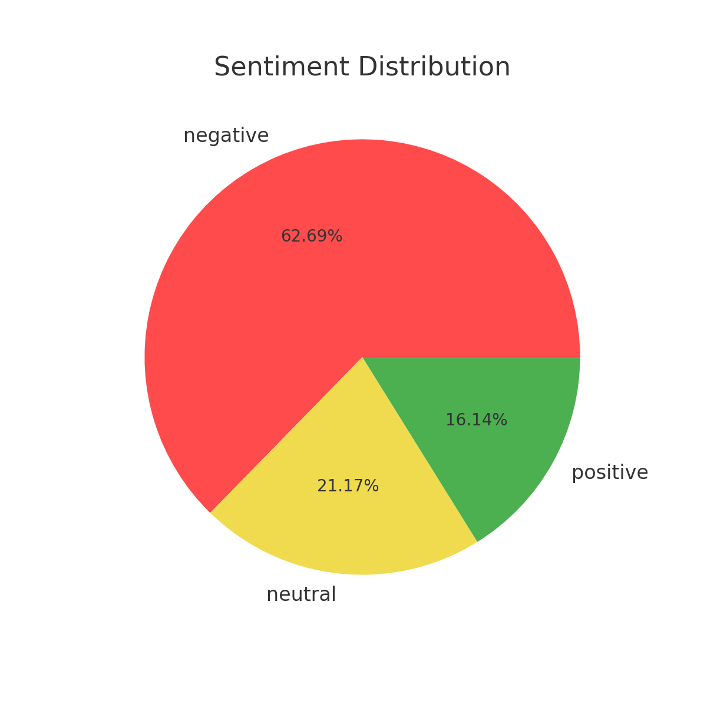
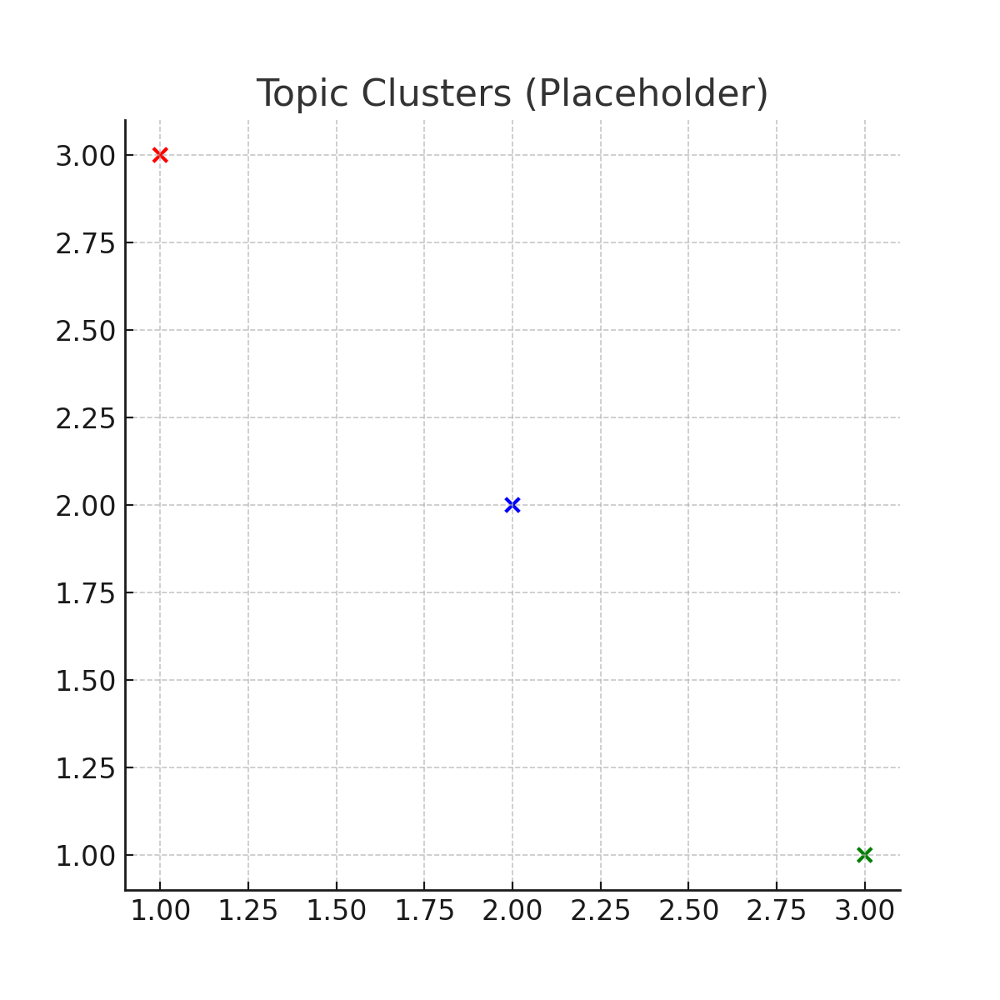
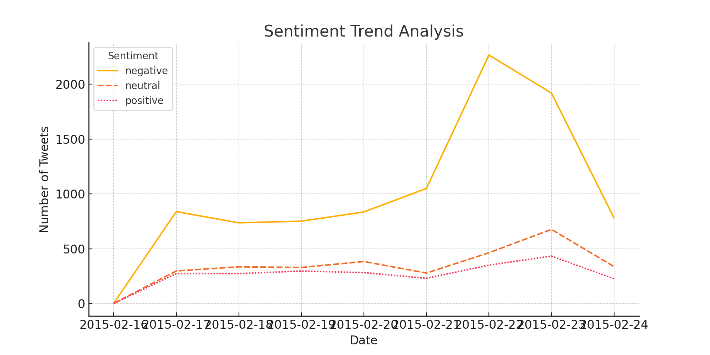

# sentiment-analysis-project

# 🚀 Sentiment Analysis & Topic Modeling on Social Media Data
This project analyzes airline-related tweets to extract insights using NLP techniques like Transformers, PyTorch, and BERTopic. The interactive dashboard offers sentiment trends, topic analysis, and actionable insights for businesses.

## 🚀 Features
Sentiment Analysis: Classifies tweets into positive, neutral, or negative sentiments.

Topic Modeling: Identifies dominant themes in customer feedback using BERTopic.

Interactive Visualizations: Presents insights via Streamlit for better user engagement.

Trend Analysis: Tracks sentiment changes over time.


## 🖥️ Setup Instructions
1. **Install dependencies:**
   ```bash
   pip install -r requirements.txt
   ```
2. **Run the Streamlit app:**
   ```bash
   streamlit run app.py
   ```

## 📊 Sample Visuals
### Sentiment Distribution


### Topic Clusters


### Trend Analysis



📊 Results & Insights

Key Observations

Topic 0: Common issues around lost baggage and luggage complaints.

Topic 7: Frequent mentions of seat upgrades and class preferences.

Actionable Insight: Airlines can prioritize improving baggage handling services and enhancing seating comfort to improve customer satisfaction.

🧰 Technologies Used

Python

BERTopic

PyTorch

Streamlit

Pandas

Matplotlib / Seaborn


